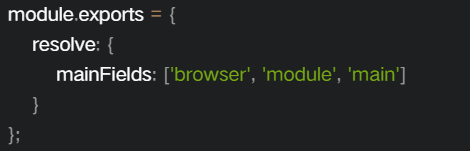

# webpack4-learning

## 模块化

模块化是指解决一个复杂问题时自顶向下逐层把系统划分成若干模块的过程，有多种属性，分别反映其内部特性。（百度百科）

模块化的设计可以为系统带来很多好处：

* ```作用域封装```：在 JavaScript 中代码执行的顶层作用域即是全局作用域，这意味着变量和函数定义很容易冲突。而使用模块将代码封装起来，可保证内部实现不会暴露在全局作用域中，我们只需将模块的功能通过接口的方式暴露出去给其它模块调用即可，避免了污染全局命名空间的问题。
* ```复用性```：在工程中经常会出现重复的部分，比如一个 Web 应用中各个页面共同的 header、footer，最原始的开发方式是将同样的代码复制粘贴到各个地方。这种做法的缺点是当这些共同的部分发生改变时，我们需要逐一改动每个地方的代码。而如果把实现一类功能的代码封装为模块之后，就可以提供给各个调用者。进行变更时只需要修改当前模块。
* ```解除耦合```：试想一下如果有一个几千行代码的文件在你的工程里，内部实现了各种各样的功能并且互相调用，这样的代码调试起来有多痛苦。将系统分解为模块的一个很重要意义就是解除各部分之间的耦合。当系统的某个部分需要发生改变的时候，通过模块我们可以快速定位问题。由于模块把功能的具体实现封装在了内部，只要模块间的接口不变，模块内部的变化对于外面的其它部分并没有感知。因此通过模块化可以提升系统的可维护性。
* ```按需加载```：如果没有模块，所有的代码将被放在一个大文件里面统统塞给用户。当页面不断地增加功能，不断地添加代码，最终的文件只会越来越大，而页面也打开地越来越慢，对于用户来说非常不友好。使用模块化来拆分逻辑可以使页面需要的资源最先被加载，而后续的模块在恰当的时机再进行异步加载，从而让页面加载速度更快，用户也得到更好的体验。

## Webpack

模块化打包工具，默认只能处理JavaScript模块文件，在 Webpack 处理应用程序时，它会在内部创建一个依赖图（dependency graph），用于映射到项目需要的每个模块，会把我们项目中使用到的多个代码模块（可以是不同文件类型），打包构建成项目运行仅需要的几个静态文件。<br>

webpack-解决什么问题？
像Grunt、Gulp这类构建工具，打包的思路是：```遍历源文件```→```匹配规则```→```打包```，这个过程中做不到按需加载，即对于打包起来的资源，到底页面用不用，打包过程中是不关心的。

webpack跟其他构建工具本质上不同之处在于：```webpack是从入口文件开始，经过模块依赖加载、分析和打包三个流程完成项目的构建。```在加载、分析和打包的三个过程中，可以针对性的做一些解决方案，比如```code split```（拆分公共代码等）。

当然，Webpack还可以轻松的解决传统构建工具解决的问题：

* ```模块化打包```：一切皆模块，JS是模块，CSS等也是模块；
* ```语法糖转换```：比如ES6转ES5、TypeScript；
* ```预处理器编译```：比如Less、Sass等；
* ```项目优化```：比如压缩、CDN；
* ```解决方案封装```：通过强大的Loader和插件机制，可以完成解决方案的封装，比如PWA；
* ```流程对接```：比如测试流程、语法检测等。

## Webpack 常见名词解释

* ```entry```：项目入口
* ```module```：开发中每一个文件都可以看做 module，模块不局限于 js，也包含 css、图片等
* ```chunk```：代码块，一个 chunk 可以由多个模块组成
* ```loader```：模块转化器，模块的处理器，对模块进行转换处理
* ```plugin```：扩展插件，插件可以处理 chunk，也可以对最后的打包结果进行处理，可以完成 loader 完不成的任务
* ```bundle```：最终打包完成的文件，一般就是和 chunk 一一对应的关系，bundle 就是对 chunk 进行压缩打包等处理后的产出

## Webpack 目前支持的占位符

* ```[hash]```：模块标识符的 hash
* ```[chunkhash]```：chunk 内容的 hash
* ```[name]```：模块名称
* ```[id]```：模块标识符
* ```[query]```：模块的 query，例如，文件名 ? 后面的字符串
* ```[function]```：一个 return 出一个 string 作为 filename 的函数

  ```[hash]```：是```整个项目```的 hash 值，其根据每次编译内容计算得到，每次编译之后都会生成新的 hash，即修改任何文件都会导致所有文件的 hash 发生改变；在一个项目中虽然入口不同，但是 hash 是相同的；hash 无法实现前端静态资源在浏览器上长缓存，这时候应该使用 chunkhash；

  ```[chunkhash]```：根据不同的入口文件（entry）进行依赖文件解析，构建对应的 chunk，生成相应的 hash；只要组成 entry 的模块文件没有变化，则对应的 hash 也是不变的，所以一般项目优化时，会将公共库代码拆分到一起，因为公共库代码变动较少的，使用 chunkhash 可以发挥最长缓存的作用；

  ```[contenthash]```：使用 chunkhash 存在一个问题，当在一个 JS 文件中引入了 CSS 文件，编译后它们的 hash 是相同的。而且，只要 JS 文件内容发生改变，与其关联的 CSS 文件 hash 也会改变，针对这种情况，可以使用mini-css-extract-plugin或extract-text-webpack-plugin把CSS从JS中抽离出来并使用contenthash

## webpack-配置支持多种语言

Webpack不仅仅支持js配置，还支持ts（TypeScript）、CoffeeScript甚至JSX语法的配置，不同语言其实核心配置项都不变，只不过语法不同而已。[了解更多](https://webpack.js.org/configuration/configuration-languages)<br>


除了配置文件的语法多样之外，对于配置的类型也是多样的，最常见的是直接作为一个对象来使用，除了使用对象，Webpack 还支持函数、Promise 和多配置数组。[了解更多](https://webpack.js.org/configuration/configuration-types)<br>

* ```函数类型的webpack配置```：如果我们只使用一个配置文件来区分生产环境（production）和开发环境（development），则可以使用函数类型的 Webpack 配置，函数类型的配置必须返回一个配置对象。Webpack配置函数接受两个参数env和argv：分别对应着环境对象和Webpack-CLI的命令行选项。
* ```Promise类型的Webpack配置```：如果需要异步加载一些Webpack配置需要做的变量，那么可以使用Promise的方式来做Webpack的配置。
* ```多配置数组```：在一些特定的场景，我们可能需要一次打包多次，而多次打包中有一些通用的配置，这时候可以使用配置数组的方式，将两次以上的Webpack配置以数组的形式导出

## Entry

支持多种类型，包括```字符串、对象、数组```。从作用上来说，包括了```单文件入口```和```多文件入口```两种方式。指示 webpack 应该使用哪个模块，来作为构建其内部依赖图的开始。进入入口起点后，webpack 会找出有哪些模块和库是入口起点（直接和间接）依赖的。每个依赖项随即被处理，最后输出到称之为 bundles 的文件中 [了解更多](https://webpack.js.org/concepts/entry-points)<br>

* ```单文件入口```：可以快速创建一个只有单一文件入口的情况，例如```library```的封装，但是单文件入口的方式相对来说比较简单，在扩展配置的时候灵活性较低。

* ```多文件入口```：是使用对象语法来通过支持多个```entry```，多文件入口的对象语法相对于单文件入口，具有较高的灵活性，例如多页应用、页面模块分离优化。

Tips：对于一个HTML页面，我们推荐只有一个```entry```，通过统一的入口，解析出来的依赖关系更方便管理和维护。

## Output

指定了entry对应文件编译打包后在哪里输出它所创建的 bundles，以及如何命名这些文件等 [了解更多](https://webpack.js.org/concepts/output)

output的常用属性是：

* ```path```：此选项制定了输出的bundle存放的路径，比如dist、output等
* ```filename```：这个是bundle的名称
* ```publicPath```：指定了一个在浏览器中被引用的URL地址。这种做法在需要将静态文件放在不同的域名或者 CDN 上面的时候是很有用的。
* ```library```：如果我们打包的目的是生成一个供别人使用的库，那么可以使用```output.library```来指定库的名称，库的名称支持占位符和普通字符串：
* ```libraryTarget```：确定了库的名称之后，还可以使用```output.libraryTarget```指定库打包出来的规范，output.libraryTarget取值范围为：var、assign、this、window、global、commonjs、commonjs2、commonjs-module、amd、umd、umd2、jsonp，默认是var。

output输出相关的三个配置项：externals，target和devtool。

## target

在项目开发中，我们不仅仅是开发 web 应用，还可能开发的是 Node.js 服务应用、或者 electron 这类跨平台桌面应用，这时候因为对应的宿主环境不同，所以在构建的时候需要特殊处理。webpack 中可以通过设置```target```指定构建的目标（target）。[了解更多](https://webpack.js.org/configuration/target/)

```target```的值有两种类型：```string``` 和 ```function```。

string类型支持下面的七种：

* ```web```：默认，编译为类浏览器环境里可用；
* ```node```：编译为类Node.js环境可用（使用Node.jsrequire加载chunk）；
* ```async-node```：编译为类Node.js环境可用（使用fs和vm异步加载分块）；
* ```electron-main```：编译为Electron主进程；
* ```electron-renderer```：编译为Electron渲染进程；
* ```node-webkit```：编译为Webkit可用，并且使用jsonp去加载分块。支持Node.js内置模块和nw.gui导入（实验性质）；
* ```webworker```：编译成一个WebWorker。

除了string类型，target还支持function类型，这个函数接收一个```compiler```作为参数

## resolve

Webpack进行构建的时候会从入口文件开始（entry）遍历寻找各个模块的依赖，resolve配置是帮助Webpack查找依赖模块的，通过resolve的配置，可以帮助Webpack快速查找依赖，也可以替换对应的依赖（比如开发环境用dev版本的lib等）[了解更多](https://webpack.js.org/configuration/resolve/)

* ```resolve.extensions```：是帮助 Webpack 解析扩展名的配置，可以省略解析扩展名的配置，默认值：```['.wasm', '.mjs', '.js', '.json']```，所以我们引入 js 和 json 文件，可以不写它们的扩展名，通常我们可以加上```.css```、```.less```等，但是要确保同一个目录下面没有重名的css或者js文件，如果存在的话，还是写全路径吧。但是配置太多反而会导致webpack解析效率下降；
* ```resolve.alias```：是最常用的配置，通过设置alias可以帮助webpack更快查找模块依赖，精简代码书写时相对路径的书写，能使我们编写代码更加方便。
* ```resolve.mainfields```：有一些我们用到的模块会针对不同宿主环境提供几份代码，例如提供 ES5 和 ES6 的两份代码，或者提供浏览器环境和 nodejs 环境两份代码，这时候在package.json文件里会做如下配置：

在Webpack中，会根据resolve.mainFields的设置去决定使用哪个版本的模块代码，在不同的target下对应的resolve.mainFields默认值不同，默认target=web对应的默认值为：所以在target=web打包时，会寻找browser版本的模块代码

* ```resolve.mainFiles```：解析目录时候的默认文件名，默认是```index```，即查找目录下面的```index```+```Bresolve.extensions```文件。
* ```resolve.modules```：查找模块依赖时，默认是node_modules
* ```resolve.symlinks```：是否解析符合链接（软连接，symlink）
* ```resolve.plugins```：添加解析插件，数组格式
* ```resolve.cachePredicate```：是否缓存，支持boolean和function，function传入一个带有path和require的对象，必须返回boolean值


## module
在webpack解析模块的同时，不同的模块需要使用不同类型的模块处理器```（Loaders）```来处理，这部分的设置就在module配置中。module有两个配置：```module.noParse```和```module.rules```[了解更多](https://webpack.js.org/configuration/resolve/)

* ```module.noParse```：可以让Webpack忽略对部分没采用模块化的文件的递归解析和处理，这样做的好处是能提高构建性能，接收的类型为正则表达式，或者正则表达式数组或者接收模块路径参数的一个函数
  * Tips：这里一定要确定被排除出去的模块代码中不能包含```import、require、define```等内容，以保证webpack的打包包含了所有的模块，不然会导致打包出来的js因为缺少模块而报错。
* ```module.rules```：是在处理模块时，将符合规则条件的模块，提交给对应的处理器来处理，通常用来配置loader，其类型是一个数组，数组里每一项都描述了如何去处理部分文件。每一项rule大致可以由以下三部分组成：
  * 条件匹配：通过```test、include、exclude```等配置来命中可以应用规则的模块文件；
    * 条件匹配相关的配置有```test、include、exclude、resource、resourceQuery和issuer```。条件匹配的对象包括三类：resource，resourceQuery和issuer。
      * ```resource```：请求文件的绝对路径。它已经根据resolve规则解析；
      * ```issuer```：被请求资源（requested+the+resource）的模块文件的绝对路径，即导入时的位置。
    * 举例来说明：从app.js导入'./style.css?inline'：
      * resource是"/path/to/style.css"；
      * resourceQuery是"?之后的inline"；
      * issuer是"/path/to/app.js"；
  * 应用规则：对匹配条件通过后的模块，使用```us```e配置项来应用```loader```，可以应用一个loader或者按照从后往前的顺序应用一组loader，当然我们还可以分别给对应loader传入不同参数；
  * 重置顺序：一组loader的执行顺序默认是**从后到前（或者从右到左）**执行，通过```enforce```选项可以让其中一个loader的执行顺序放到最前（pre）或者是最后（post）

  rule 对应的配置与匹配的对象关系表：

  | rule 配置项     | 匹配的对象                 | 
  | -------------- | -------------------------- | 
  | test          | resource类型                |
  | include       | resource类型                |
  | exclude       | resource类型                |
  | resource      | resource类型                |
  | resourceQuery | resourceQuery类型           |
  | issuer        | issuer类型                  |

## Loaders
让 webpack 能够去处理那些非 JavaScript 文件（webpack 自身只理解 JavaScript）。我们可以把 loader 理解为是一个转换器，loader 可以将所有类型的文件转换为 webpack 能够处理的有效模块，然后你就可以利用 webpack 的打包能力，对它们进行处理 [了解更多](https://webpack.js.org/concepts/loaders/)<br>

loader有两种配置方式：

* ```使用webpack.config.js的配置方式```;
* ```在JavaScript文件内使用内联配置方式```：

给loader传参的方式有两种：

* ```通过options传入```
* ```通过query的方式传入```：loader:'html-loader?minimize=true&removeComments=false&collapseWhitespace=false'

常用的loader：

* [file-loader](https://webpack.js.org/loaders/file-loader)：打包图片资源，字体等文件. 
* [url-loader](https://webpack.js.org/loaders/url-loader)：功能类似于 file-loader，但是在文件大小（单位 byte）低于指定的限制时，可以返回一个 DataURL，图片资源较小时适合使用url-loader，可以减少http请求，图片过大会导致打包生成的js文件过大，导致页面加载慢
* [css-loader]((https://webpack.js.org/loaders/css-loader))：处理文件中@import 的特点,处理css文件
  * ```modules```：启用/禁用CSS模块化。```CSS Modules```既不是官方标准，也不是浏览器的特性，而是在构建过程中对CSS类名选择器限定作用域的一种方式，如我们的广告样式、某个UI通用弹层SDK这类样式，都需要避免自己的命名跟宿主环境的样式冲突。CSS Modules主要解决的问题有：
    * 解决CSS类都是全局的，容易造成全局污染（样式冲突）；
    * JS和CSS共享类名；
    * 可以方便的编写出更加健壮和扩展方便的CSS。
  * ```importLoaders```：这个参数用于配置css-loader作用于@import的资源之前有多少个loader
* [style-loader](https://webpack.js.org/loaders/style-loader)：将解析的css内容用style标签的形式挂载到页面
* [less-loader](https://www.webpackjs.com/loaders/less-loader)：将less文件编译为css文件 
* [postcss-loader](https://webpack.js.org/loaders/postcss-loader)：配置了postcss-loader之后，WebPack就可以使用[PostCSS](https://postcss.org/)来处理CSS了。<br>

## PostCSS

CSS后处理器；通过PostCSS的强大插件系统，不仅可以处理CSS语法，还可以处理CSS预处理器的语法，实现的功能也有很多，包括添加前缀、最新语法转义、压缩等，甚至可以扩展CSS的语言特性。

PostCSS的配置写法有以下三种方式：

* 通过配置文件postcss.config.js，一般放置在项目的根目录下；
* 通过loader的配置项options；
* 直接在package.json中添加个postcss属性。

PostCSS常用插件：

* [Autoprefixer](https://github.com/postcss/autoprefixer#options)：这个插件就是给css补齐各种浏览器私有的前缀；
* [postcss-preset-env](https://preset-env.cssdb.org/)：是跟babel的preset-env类似的功能，通过它可以安心的使用最新的CSS语法来写样式，不用关心浏览器兼容性，浏览器兼容的问题交给了postcss-preset-env和WebPack，在打包构建的时候，会根据不同的配置输出对应支持的CSS文件。postcss-preset-env支持的CSS标准，完全可以媲美CSS预处理器的功能，所以如果对cssnext新的标准比较熟悉，可以直接用新标准来写样式，这样等到浏览器支持新标准之后可以无缝切换到cssnext语法，那么可以直接抛弃CSS预处理器，直接使用cssnext语法来写样式，通过WebPack和postcss-preset-env来构建。
* [ssnano](https://cssnano.co/)：是一个强大的PostCss插件，在CSS压缩优化中会经常被用到，它有别于常规的CSS压缩工具只是去除空格注释，还支持根据CSS语法解析结果智能压缩代码

## Plugins
插件目的在于解决 loader 无法实现的其他事，让打包的过程更加便捷，可以在webpack运行到某个时刻的时候，帮你做一些事情。插件的范围包括，从打包优化和压缩，一直到重新定义环境中的变量。Webpack本身就是有很多插件组成的，所以内置了很多插件，我们可以直接通过webpack对象的属性来直接使用，例如：webpack.optimize.UglifyJsPlugin。 [了解更多](https://webpack.js.org/concepts/plugins)<br>

* [html-webpack-plugin](https://webpack.js.org/loaders/file-loader)：打包之后自动生成一个 HTML 文件， 并把打包生成的js文件自动引入到这个html文件中
* [clean-webpack-plugin](https://www.npmjs.com/package/clean-webpack-plugin)：用于打包之前，删除/清除构建文件夹
* [HotModuleReplacementPlugin](https://webpack.js.org/plugins/hot-module-replacement-plugin)：启用热替换模块(Hot Module Replacement)，也被称为 HMR，实时预览修改后的页面，无需重新加载整个页面  [API调用](https://webpack.js.org/api/hot-module-replacement)<br> 
* [ProvidePlugin](https://webpack.js.org/plugins/provide-plugin)：自动加载模块，而不必到处 import 或 require

Tips：```loader```面向的是解决某个或者某类模块的问题，而```plugin```面向的是项目整体，解决的是```loader```解决不了的问题。

## Mode
通过选择 development 或 production 之中的一个，来设置 mode 参数，你可以启用相应模式下的 webpack 内置的优化 [了解更多](https://webpack.js.org/configuration/mode/)<br>

## devtool
此选项控制是否生成，以及如何生成 source-map [了解更多](https://webpack.js.org/configuration/devtool)<br>
* ```source-map```：定义源码以及打包后的代码的映射关系，通过 sourcemap 我们可以快速还原代码的错误位置。 [介绍](https://blog.teamtreehouse.com/introduction-source-maps)<br>

## devServer
webpack-dev-server 能够用于快速开发应用程序，会将打包后的文件保存在内存中，不会放在指定文件夹，从而提升打包速度 [了解更多](https://webpack.js.org/configuration/dev-server/)<br>
每次要编译代码时，手动运行 npm run build 就会变得很麻烦。webpack 中有几个不同的选项，可以帮助你在代码发生变化后自动编译代码：<br>

* [webpack's Watch Mode](https://webpack.js.org/guides/development/#using-watch-mode)
* [webpack-dev-server](https://webpack.js.org/guides/development/#using-webpack-dev-server)
* [webpack-dev-middleware](https://webpack.js.org/guides/development/#using-webpack-dev-middleware)


## 转换es6

**Babel <br>**
Babel 是一个工具链，主要用于将 ECMAScript 2015+ 版本的代码转换为向后兼容的 JavaScript 语法，以便能够运行在当前和旧版本的浏览器或其他环境中 [了解更多](https://babeljs.io/docs/en/)<br><br>
[让Babel与你所使用的工具协同工作](https://babeljs.io/setup)<br>
* ```babel-loader```：结合webpack实现es6语法转化 <br>
* ```babel/core```：Babel核心库，babel-loader内部会调用@babel/core进行转化 <br>
* ```babel-preset-env```：包含es6、7等版本的语法转化规则 [了解更多](https://babeljs.io/docs/en/babel-preset-env)<br>
* ```babel-polyfill```：Babel默认只转换新的JavaScript句法（syntax），而不转换新的API，比如Iterator、Generator、Set、Maps、Proxy、Reflect、Symbol、Promise等全局对象，以及一些定义在全局对象上的方法（比如Object.assign）都不会转码。举例来说，ES6在Array对象上新增了Array.from方法。Babel就不会转码这个方法。如果想让这个方法运行，必须使用babel-polyfill，为当前环境提供一个垫片 [了解更多](https://babeljs.io/docs/en/babel-polyfill)<br>
* ```babel-polyfill缺点```：<br>
    1：可能会增加很多根本没有用到的polyfill；[useBuiltIns 解决方法](https://babeljs.io/docs/en/babel-preset-env#usebuiltins)<br>
    2：可能会污染子模块的局部作用域，严重的或许会导致冲突，旨在用于应用程序，业务逻辑而不是库/工具；<br>
* ```babel/plugin-transform-runtime```：将开发者依赖的全局内置对象等，抽取成单独的模块，并通过模块导入的方式引入，避免了对全局作用域的修改（污染），同时能按需注入polyfill；[了解更多](https://babeljs.io/docs/en/babel-plugin-transform-runtime)<br>

## 打包React代码

**babel/preset-react [了解更多](https://babeljs.io/docs/en/babel-preset-react)<br>**

## Tree Shaking

移除 JavaScript 上下文中的未引用代码；基于 ES6 的[静态引用]，tree shaking 通过扫描所有 ES6 的 export，找出被 import 的内容并添加到最终代码中。 webpack 的实现是把所有 import 标记为有使用/无使用两种，在后续压缩时进行区别处理。源码必须遵循 ES6 的模块规范 (import & export)，如果是 CommonJS 规范 (require) 则无法使用 [了解更多](https://webpack.js.org/guides/tree-shaking)<br>

* ```sideEffects```：如果我们引入的 包/模块 被标记为 sideEffects: false 了，那么不管它是否真的有副作用，只要它没有被调用，整个 模块/包 都会被完整的移除 [演示代码](./tree_shaking)<br>

## 区分生产环境/开发环境

开发环境(development)和生产环境(production)的构建目标差异很大。在开发环境中，我们需要具有强大的、具有实时重新加载(live reloading)或热模块替换(hot module replacement)能力的 source map 和 localhost server。而在生产环境中，我们的目标则转向于关注更小的 bundle，更轻量的 source map，以及更优化的资源，以改善加载时间。由于要遵循逻辑分离，我们通常建议为开发与生产环境编写彼此独立的 webpack 配置。同时抽离公共的配置。并且使用 ```webpack-merge ```合成生成最终开发与生产环境配置文件。 [了解更多](https://webpack.js.org/guides/production)  [演示代码](./development_production)<br>

## Code Splitting 代码分割
代码分离是 webpack 中最引人注目的特性之一。此特性能够把代码分离到不同的 bundle 中，然后可以按需加载或并行加载这些文件。代码分离可以用于获取更小的 bundle，以及控制资源加载优先级，如果使用合理，会极大影响加载时间 [了解更多](https://webpack.js.org/guides/code-splitting) [演示代码](./code_splitting)<br>
webpack中实现代码分割，两种方式<br>
* ```同步代码```： 只需要在配置文件中中做optimization的配置即可<br>
* ```异步代码(import)```: 异步代码，无需做任何配置，会自动进行代码分割，放置到新的文件中<br><br>
    
有三种常用的代码分离方法：<br>

* ```入口起点```：使用 entry 配置手动地分离代码。 [了解更多](https://webpack.js.org/guides/code-splitting/#entry-points)<br> 
    这种方法存在一些问题:<br>
    * 如果入口 chunks 之间包含重复的模块，那些重复模块都会被引入到各个 bundle 中。<br>
    * 这种方法不够灵活，并且不能将核心应用程序逻辑进行动态拆分代码。<br>
* 防止重复：使用 SplitChunksPlugin 去重和分离 chunk。 [了解更多](https://webpack.js.org/plugins/split-chunks-plugin/)<br>
    * ```chunks```：表示从哪些chunks里面抽取代码，除了三个可选字符串值 initial、async、all 之外，还可以通过函数来过滤所需的 chunks。<br>
    * ```minSize```：表示抽取出来的文件在压缩前的最小大小，默认为30000，需要进行代码分离的代码块要大于30000，否则不生成新chunk。<br>
    * ```maxSize```：表示抽取出来的文件在压缩前的最大大小，默认为 0，表示不限制最大大小。<br>
    * ```minChunks```：表示module在打包后的chunks（打包后的代码文件）中被引用的次数，默认为1，大于等于该次数才会进行代码分割<br>
    * ```maxAsyncRequests```：最大的按需(异步)加载次数，默认为 5，超过该值，其他的module不会进行代码分割<br>
    * ```maxInitialRequests```：入口文件最大的初始化加载次数，默认为 3，超过该值，其他的module不会进行代码分割<br>
    * ```automaticNameDelimiter```：分割出来的文件的自动生成名字的分割符，默认为 ~<br>
    * ```name```：chunk的名字，如果设成true，会根据被提取的chunk自动生成。<br>
    * ```cacheGroups```： 缓存组才是我们配置的关键。它可以继承/覆盖上面 splitChunks 中所有的参数值，除此之外还额外提供了三个配置，分别为：```test, priority 和 reuseExistingChunk```。要禁用默认缓存组，请将default设置为false。<br>
        * ```test```：用来决定提取哪些module，默认为所有的 modules，可匹配模块路径或 chunk 名字，当匹配的是 chunk 名字的时候，其里面的所有 modules 都会选中。<br>
        * ```priority```：表示抽取权重，数字越大表示优先级越高。因为一个 module 可能会满足多个 cacheGroups 的条件，分割到priority高的cacheGroups<br>
        * ```reuseExistingChunk```: 表示是否使用已有的 chunk，如果为 true 则表示如果当前的 chunk 包含的模块已经被抽取出去了，那么将不会重新生成新的.<br>
* ```动态导入```：通过模块的内联函数调用来分离代码。 [了解更多](https://webpack.js.org/guides/code-splitting/#dynamic-imports)<br> 

## css文件代码分割
注意：对css代码进行代码分割，需要配置sideEffects，消除tree shaking的影响  如果sideEffects：false，css代码会被过滤掉

* [MiniCssExtractPlugin](https://webpack.js.org/plugins/mini-css-extract-plugin)：将CSS提取为独立的文件的插件，对每个包含css的js文件都会创建一个CSS文件，支持按需加载css和sourceMap
* [OptimizeCSSAssetsPlugin](https://github.com/NMFR/optimize-css-assets-webpack-plugin)：css代码压缩优化 [演示代码](./code_splitting_css)<br>

## Bundle Analysis 打包分析
如果我们以分离代码作为开始，那么就以检查模块作为结束，分析输出结果是很有用处的。[官方分析工具](https://github.com/webpack/analyse) 是一个好的初始选择 [了解更多](https://webpack.js.org/guides/code-splitting/#bundle-analysis)<br>

## Prefetching/Preloading 
Preload是预加载，PreFetch是预测将要加载的模块，这两者都是link标签下的属性 [了解更多](https://mp.weixin.qq.com/s?__biz=MzUxMzcxMzE5Ng==&mid=2247485614&amp;idx=1&amp;sn=b25bac7cfbb02bdcab76b41f10a4bffb&source=41#wechat_redirect) [使用](https://webpack.js.org/guides/code-splitting/#prefetchingpreloading-modules) [演示代码](./prefetching_preloading)<br><br>
Preload优先级比PreFetch高。这两者是有区别的：<br>
* ```preload```：主要是用于当前页面的预加载，会和主文件bundle.js并行下载，且优先获取，可用于预加载某些必要模块<br>
* ```prefetch```: 主要是用于下一步操作或者页面，会在浏览器空闲时间才去下载，优先级低<br>

## Lazy Loading 懒加载
懒加载或者按需加载，是一种很好的优化网页或应用的方式。这种方式实际上是先把你的代码在一些逻辑断点处分离开，然后在一些代码块中完成某些操作后，立即引用或即将引用另外一些新的代码块。这样加快了应用的初始加载速度，减轻了它的总体体积，因为某些代码块可能永远不会被加载。 [了解更多](https://webpack.js.org/guides/lazy-loading) [演示代码](./lazy_loading)<br>

## Caching 缓存
我们使用 webpack 来打包我们的模块化后的应用程序，webpack 会生成一个可部署的 /dist 目录，然后把打包后的内容放置在此目录中。只要 /dist 目录中的内容部署到服务器上，客户端（通常是浏览器）就能够访问网站此服务器的网站及其资源。而最后一步获取资源是比较耗费时间的，这就是为什么浏览器使用一种名为 缓存 的技术。可以通过命中缓存，以降低网络流量，使网站加载速度更快，然而，如果我们在部署新版本时不更改资源的文件名，浏览器可能会认为它没有被更新，就会使用它的缓存版本。由于缓存的存在，当你需要获取新的代码时，就会显得很棘手。通过必要的配置，以确保 webpack 编译生成的文件能够被客户端缓存，而在文件内容变化后，能够请求到新的文件 [了解更多](https://webpack.js.org/guides/caching) [演示代码](./caching)<br>
* ```contenthash```：根据文件的内容添加唯一的哈希。当文件的内容发生变化时，contenthash也会发生变化<br>
* ```runtimeChunk```：解决老版本webpack打包时，文件内容没有变化但是contenthash变化bug <br>

## Authoring Libraries 打包库
除了打包应用程序代码，webpack 还可以用于打包 JavaScript library。 [了解更多](https://webpack.js.org/guides/author-libraries) [演示代码](./library)<br>

对于库的广泛使用，我们希望它在不同的环境中兼容，即CommonJS，AMD，Node.js和全局变量。要使您的库可供使用，需要在 output 中添加 library 属性，为了让 library 和其他环境兼容，还需要在配置文件中添加 libraryTarget 属性。这是可以控制 library 如何以不同方式暴露的选项；

一般需要同时配置library，libraryTarget来兼容实现CommonJS，AMD，Node.js和全局变量

externals：配置项用于去除输出的打包文件中依赖的某些第三方 js 模块（例如```jquery```，```vue```等等），减小打包文件的体积。该功能通常在开发自定义 js 库（library）的时候用到，用于去除自定义 js 库依赖的其他第三方 js 模块。这些被依赖的模块应该由使用者提供，而不应该包含在 js 库文件中。例如开发一个 jQuery 插件或者 Vue 扩展，不需要把 jQuery 和 Vue 打包进我们的 bundle，引入库的方式应该交给使用者。[了解更多](https://webpack.js.org/configuration/externals/#externals)

所以，这里就有个重要的问题，使用者应该怎么提供这些被依赖的模块给我们的 js 库（library）使用呢？这就要看我们的 js 库的导出方式是什么，以及使用者采用什么样的方式使用我们的库。例如：

| js library导出方式  | output.libraryTarget                 | 使用者引入方式                 | 使用者引入方式  |
| -------------- | ---------------------------- | ----------------------------- | ------------------------------- |
| 默认的导出方式   | output.libraryTarget=‘var’  | 只能以```<script>```标签的形式引入我们的库  | 只能以```全局变量```的形式提供这些被依赖的模块        |
| commonjs       | commonjs                     | 只能按照```commonjs```的规范引入我们的库  | 被依赖模块需要按照 commonjs 规范引入               |
| amd            | output.libraryTarget=‘amd’   | 只能按照 amd 规范引入          | 被依赖模块需要按照 amd 规范引入    |
| umd            | output.libraryTarget=‘umd’   | 可以用```<script>```、commonjs、amd引入  | 被依赖模块需要按照对应方式引入  |

如果不是在开发一个js库，即没有设置```output.library```，```output.libraryTarget```等配置信息，那么我们生成的打包文件只能以```<script>```标签的方式在页面中引入，因此那些被去除的依赖模块也只能以全局变量的方式引入。

## Progressive Web Application PWA 渐进式网络应用程序
渐进式网络应用程序[(Progressive Web Application - PWA)](https://developers.google.com/web/progressive-web-apps/)，是一种可以提供类似于原生应用程序(native app)体验的网络应用程序(web app)。PWA 可以用来做很多事。其中最重要的是，在离线(offline)时应用程序能够继续运行功能。这是通过使用名为 [Service Workers](https://developers.google.com/web/fundamentals/primers/service-workers/) 的网络技术来实现的。 [了解更多](https://webpack.js.org/guides/progressive-web-application/) [演示代码](./pwa)<br>
* Workbox：PWA的JavaScript库集合[了解更多](https://github.com/GoogleChrome/workbox/)

## TypeScript

[TypeScript](https://www.typescriptlang.org/) 是 JavaScript 的超集，为其增加了类型系统，可以编译为普通的 JavaScript 代码。 [了解更多](https://webpack.js.org/guides/typescript/) [演示代码](./typescript)<br>

## 语法检测

* [ESLint](https://cn.eslint.org/)：是通过配置规则（Rules）来检测JavaScript语法规范的。可以通过ESLint在团队内快速统一ES6的语法，精简产品代码，提高开发效率，另外ESLint的扩展性很好，能够很好的支持JSX语法的检测。业内比较著名的规范有：[Airbnb的JavaScript代码规范](https://github.com/airbnb/javascript)、[JavaScriptStandardStyleGuide](https://github.com/standard/standard)、[GoogleJavaScript代码规范](https://google.github.io/styleguide/jsguide.html)，国内则有百度的[FECS](http://fecs.baidu.com/)
  
  Webpack中使用ESLint首先需要安装eslint-loader：然后在webpack.config.js进行配置。

  Tips：ESLint的报错类型包括三种：off、warn和error，分别对应着：0、1、2。

* [StyleLint](https://stylelint.io/)检测CSS语法。StyleLint 和 ESLint 很像，它们都只是提供了工具与规则，如何配置这些规则完全取决于使用者，所以我们要根据需要自己引入或配置规则。StyleLint 的代码风格也有很多社区开源版本，官方推荐的代码风格有两个：
  * [stylelint-config-recommended](https://github.com/stylelint/stylelint-config-recommended)
  * [stylelint-config-standard](https://github.com/stylelint/stylelint-config-standard)
  
  Tips：除了StyleLint本身之外，还可以安装[stylelint-order](https://github.com/hudochenkov/stylelint-order)插件，该插件的作用是强制我们在写CSS的时候按照某个顺序来编写。例如先写定位，再写盒模型，再写内容区样式，最后写CSS3相关属性。这样可以极大的保证我们代码的可读性和风格统一。

  Webpack中使用StyleLint是通过插件的方式来使用，这个插件的名字是[stylelint-webpack-plugin](https://www.npmjs.com/package/stylelint-webpack-plugin)。

## webpack-dev-server 
* devServer.proxy：实现请求转发，如果你有单独的后端开发服务器 API，并且希望在同域名下发送 API 请求 ，那么代理某些 URL 会很有用。dev-server 使用了非常强大的 [http-proxy-middleware](https://github.com/chimurai/http-proxy-middleware) 包。更多高级用法，请查阅其[文档](https://github.com/chimurai/http-proxy-middleware#options) [演示代码](./proxy)。<br>
* devServer.historyApiFallback：当使用 [HTML5 History API](https://developer.mozilla.org/en-US/docs/Web/API/History) 时，任意的 404 响应都可能需要被替代为 index.html，通过设置historyApiFallback: true启用 [了解更多](https://webpack.js.org/configuration/dev-server/#devserverhistoryapifallback)

## webpack 的性能瓶颈
webpack 的优化瓶颈，主要是两个方面：

*   webpack 的构建过程太花时间
*   webpack 打包的结果体积太大

## Build Performance  构建性能 提高打包效率速度
* 1：跟上技术的迭代（Node，Npm，Yarn）。使用最新的 webpack 版本。我们会经常进行性能优化。保持最新的 Node.js 也能够保证性能。除此之外，保证你的包管理工具 (例如 npm 或者 yarn ) 为最新也能保证性能。较新的版本能够建立更高效的模块树以及提高解析速度<br>
* 2：将 loaders 应用于最少数的必要模块中。使用include字段仅将loader模块应用在实际需要用其转换的位置中，使用exclude字段排除特定条件。<br>
* 3：plugin尽可能精简且确保可靠，插件选择要合理，尽量选择官方推荐的性能比较好的插件。<br>
*4：[resolve](https://webpack.js.org/configuration/resolve/#root)参数合理[配置](https://webpack.js.org/guides/build-performance#resolving)。<br>
* 5：使用[ DllPlugin](https://webpack.js.org/plugins/dll-plugin/#root) 将更改不频繁的代码进行单独编译。这将改善引用程序的编译速度，即使它增加了构建过程的复杂性[演示代码](./dll)。<br>

[了解更多](https://webpack.js.org/guides/build-performance) <br>

## 参考

- [从基础到实战	手把手带你掌握新版Webpack4.0](https://coding.imooc.com/class/316.html)
- [四大维度解锁Webpack3.0前端工程化](https://coding.imooc.com/class/171.html)


